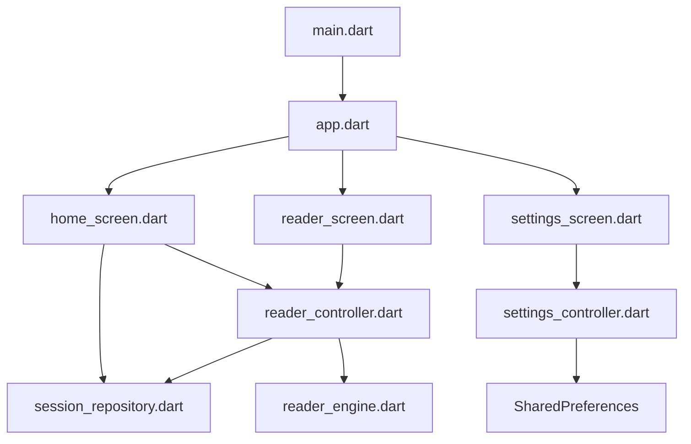

# Project Memory: RedReader

RedReader is a fast speed-reading application built with Flutter. It focuses on efficiency and a minimal reading experience.

## Project Structure

- **lib/**
  - **core/**: Shared constants and theme.
    - `constants/demo_text.dart`: Demo text for initial app run.
    - `theme/app_theme.dart`: Light and dark theme definitions.
  - **features/**: Feature-based architecture.
    - **home/**: Dashboard, session listing, and file/text input.
      - `presentation/home_screen.dart`: Main entry screen.
    - **library/**: Data management for reading sessions.
      - `data/session_repository.dart`: Hive-based session storage.
    - **reader/**: Core reading engine and presentation.
      - `domain/reader_engine.dart`: Logic for calculating word delays based on WPM and word length.
      - `domain/token.dart`: Token model for words.
      - `domain/tokenizer.dart`: Logic to split text into tokens.
      - `presentation/reader_controller.dart`: State management for the reader.
      - `presentation/reader_screen.dart`: Visual reading interface.
    - **settings/**: Application settings.
      - `presentation/settings_controller.dart`: State management for settings.
      - `presentation/settings_screen.dart`: Settings UI.
  - **shared/**: Shared models.
    - `models/app_settings.dart`: Model for user preferences.
    - `models/session.dart`: Model for a reading session.
  - `app.dart`: Main app widget and router configuration.
  - `main.dart`: App entry point.

## Tech Stack

- **Framework**: Flutter
- **State Management**: Riverpod (Version 3.3.1)
- **Navigation**: GoRouter
- **Local Storage**: Hive (sessions), SharedPreferences (settings)
- **UI Components**: Material 3, Google Fonts
- **Utilities**: FilePicker (for TXT uploads)

## Functional Relations

## Known Issues & Migration Status (Riverpod 3.3.1)

1.  **Riverpod 3.x Migration**:
    - `StateNotifier` and `StateNotifierProvider` are now considered legacy and moved to `package:flutter_riverpod/legacy.dart`.
    - Recommendation: Migrate to `Notifier` and `NotifierProvider`.
2.  **Import Path Errors**: `home_screen.dart` has incorrect relative paths for some features.
3.  **FilePicker API**: `FilePicker.platform` is no longer used; use `FilePicker.instance` or directly call `FilePicker.platform` if it's still available but it seems to have changed. Actually, `FilePicker.platform` might be replaced by `FilePicker.instance`.
4.  **Flutter Deprecations**: `DropdownButtonFormField` usage of `value` is deprecated in favor of `initialValue` in recent Flutter versions.

## Development Notes

- Use `Notifier` instead of `StateNotifier`.
- Use `Ref` directly in notifiers as it is now unified.
- Ensure all repository calls are handled through providers.
